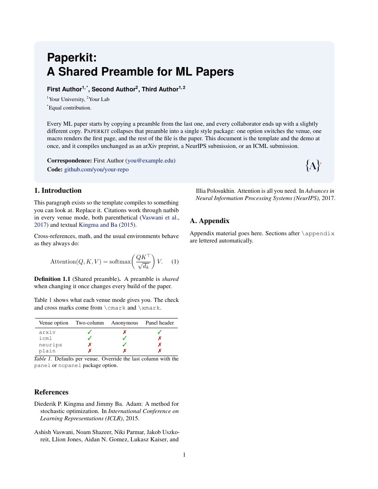
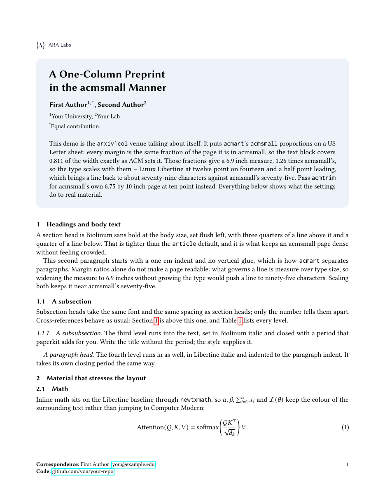

# paperkit

One LaTeX preamble for ML papers. Copy this folder, write your paper, and switch
venue with a single word:




```latex
\usepackage[arxiv]{styles/paperkit}     % preprint, two-column, rounded title panel
\usepackage[arxiv1col]{styles/paperkit} % preprint, one-column, acmsmall look
\usepackage[neurips]{styles/paperkit}   % NeurIPS 2026 submission (anonymous)
\usepackage[icml]{styles/paperkit}      % ICML 2026 submission (anonymous)
\usepackage[plain]{styles/paperkit}     % plain article, no venue style
```

The same `main.tex` and the same `sections/*.tex` compile in every mode. Nothing
else in the document changes.

## Quick start

```bash
cp -r paperkit my-paper && cd my-paper
make            # arXiv preprint  -> main.pdf
make arxiv1col  # one-column preprint, acmsmall look
make neurips    # NeurIPS submission
make icml       # ICML submission
make plain      # no venue style
make FINAL=1 neurips    # camera-ready, de-anonymized
make clean
```

`make <venue>` also drops a copy at `build/main-<venue>.pdf`, so you can keep the
preprint and the submission side by side.

The Makefile sets the venue on the command line, so you never have to edit
`main.tex` to switch. If you compile by hand or on Overleaf, edit the
`\usepackage[...]` line instead.

## Front matter

Set these in the preamble; only the title is required. `\makepaperheader`
renders whichever first page the venue calls for.

```latex
\papertitle[Plain title for PDF metadata]{Typeset Title:\\Second Line}
\paperrunningtitle{Short Title for the Header}
\paperauthors{First Author\textsuperscript{1,\,*}, Second Author\textsuperscript{2}}
\paperaffiliations{\textsuperscript{1}Your University, \textsuperscript{2}Your Lab}
\papernote{\textsuperscript{*}Equal contribution.}
\paperabstract{\input{sections/abstract}}
\papercorrespondence{First Author (\href{mailto:you@example.edu}{you@example.edu})}
\papercode{\href{https://github.com/you/repo}{github.com/you/repo}}
\paperlogo{Your Lab}{figures/logo-placeholder.pdf}   % either argument may be empty
\addpaperlogo[26pt]{figures/partner-logo.pdf}        % repeat for more marks

\begin{document}
\makepaperheader
```

Four more fields feed the `arxiv1col` running head and foot, and are ignored by
every other venue:

```latex
\paperbrand[11pt]{figures/ara-logo.png}{ARA Labs}  % lockup at the left of the head
\papershortauthors{Falck et al.}                   % verso side of the head
\papercopyright{\textcopyright\ 2026 ARA Labs. All rights reserved.}
\paperdate{14 August 2026}                         % optional; off by default
```

Keep `sections/abstract.tex` as raw body text with no `\begin{abstract}` wrapper.
That is what lets the same file go into the panel for the preprint and into the
venue's abstract environment for the submission.

## What each venue mode gives you

| Option | Style file | Columns | Anonymous | First page |
| --- | --- | --- | --- | --- |
| `arxiv` (default) | `icml2026` + `preprint` | two | no | rounded panel |
| `arxiv1col` | none (acmsmall settings) | one | no | rounded panel |
| `icml` | `icml2026` | two | yes (until `final`) | ICML title block |
| `neurips` | `neurips_2026` | one | yes (until `final`) | NeurIPS title block |
| `neurips2025` | `neurips_2025` | one | yes (until `final`) | NeurIPS title block |
| `plain` | none | one | no | `\maketitle` |

## Package options

| Option | Effect |
| --- | --- |
| `final` | Camera-ready: de-anonymize, print the conference notice |
| `preprint` | NeurIPS style in preprint mode (named authors, no notice) |
| `nonatbib` | Do not load natbib, so the document can use BibLaTeX |
| `panel` / `nopanel` | Force the rounded title panel on or off |
| `colorlinks` | Colored hyperlinks instead of boxed ones |
| `notheorems` | Skip the theorem environments |
| `minimal` | Skip tikz, listings, and pifont for faster compiles |
| `nolibertine` | `arxiv1col` only: keep the default fonts instead of Libertine |
| `acmtrim` | `arxiv1col` only: acmsmall's 6.75 x 10 in page at 10 pt |
| `noheader` | `arxiv1col` only: drop the branded head and foot for a plain page number |

Two knobs live outside the option list, because they have to be set before the
package loads:

```latex
\def\pkstyledir{mystyles/}      % where the venue .sty files live (default: styles/)
\def\pkneuripstrack{position}   % NeurIPS camera-ready track: main (default), position, eandd, creativeai
\usepackage[neurips]{styles/paperkit}
```

## The one-column preprint (`arxiv1col`)

`arxiv1col` is the two-column `arxiv` mode's quieter sibling: same front matter,
same panel, but a single column set the way ACM's `acmart` sets `acmsmall`.

It is a US Letter sheet carrying acmsmall's proportions. Every margin is the
same fraction of the page it is in acmsmall, so the text block lands on the
same fraction of the sheet:

| | `acmsmall` | `arxiv1col` (Letter) | `arxiv1col` + `acmtrim` |
| --- | --- | --- | --- |
| Trim | 6.75 x 10 in | 8.5 x 11 in | 6.75 x 10 in |
| Side margin | 46 pt = 0.0943 w | 57.93 pt = **0.0943 w** | 46 pt |
| Top | 58 pt = 0.0803 h | 63.8 pt = **0.0803 h** | 58 pt |
| Bottom | 44 pt = 0.0609 h | 48.4 pt = **0.0609 h** | 44 pt |
| `\textwidth` | 395.82 pt = 0.8114 w | 498.44 pt = **0.8114 w** | 395.82 pt |
| Text | Libertine 10/12 | Libertine 11/13.6 | Libertine 10/12 |
| Title | 17 pt (`\LARGE`) | 17 pt (`\LARGE`) | 17 pt (`\LARGE`) |
| Characters per line | 97 | 109 | 97 |

The type size is the part that cannot be copied across. Holding the margin
ratios on a sheet 1.26 times wider gives a 6.9 in measure, and what governs a
line is measure over type size, not measure alone, so the two have to move
together. Measured over an 8k-character sample, that 6.9 in line runs 122
characters at 10 pt, 109 at 11 pt and 101 at 12 pt, against acmsmall's own 97.

12 pt is therefore the size that matches acmsmall's density exactly, but it
sets a preprint in type noticeably larger than the 10-11 pt readers expect.
`arxiv1col` uses 11 pt instead: about 12% more characters per line than
acmsmall, on a page that reads as a normal preprint. Both are long measures --
acmsmall is a journal format tuned for page economy, and 97 characters is well
past the 45-75 that typographic convention recommends. If you want the shorter
line rather than the familiar page, `acmtrim` gives you acmsmall exactly.

The title does not scale with the body. `acmart` sets the acmsmall title with
`\LARGE`, which is `\@xviipt` = 17.28 pt in both `size10.clo` and `size11.clo`,
so both pages carry the same 17 pt title whichever body size they use.

Everything else -- Biolinum sans headings flush left, run-in italic
subsubsection and paragraph heads with a closing period, `newtxmath` on
Libertine letters, Inconsolata mono, a one em indent with no `parskip` -- is
`acmart`'s, unchanged.

### The running head and foot

`arxiv1col` carries branded page furniture. The horizontal lockup -- the mark
and the wordmark from `\paperbrand` -- sits at the left of the head on every
page. Opposite it:

| Page | Right of the head |
| --- | --- |
| 1 | empty, unless `\paperdate` is set |
| odd | `\paperrunningtitle` |
| even | `\papershortauthors` |

The first page is empty on that side because acmart's is: `firstpagestyle`
keeps the top right for `\acmBadgeR`, the artifact-evaluation seal, which almost
no paper sets. acmart puts no date in the head at all -- its publication line
lives in the foot, which is why `\papercopyright` sits there.

The alternation is acmsmall's: the short title on the recto, the short author
list on the verso, set in acmart's `\@headfootfont` -- Biolinum at footnote
size, the same sans as the section heads. The lockup wordmark and the folio
take it too, so both sides of the head sit on one baseline at one size. Either
side falls back to the other when only one is set, and the short title falls
back to the plain-text title from `\papertitle`, so the head is never blank.

Neither end carries a rule, as in acmart -- both `standardpagestyle` and
`firstpagestyle` zero the two widths.

The foot of the first page carries `\papercorrespondence` and `\papercode`,
where acmsmall puts its author addresses, rather than running them under the
abstract. They wrap inside a measure that stops short of the folio. Later pages
show the page number alone, unless `\papercopyright` is set.

### The title block

The title, authors, affiliations, and note are flush left, as in acmsmall. The
abstract below them is justified, which is the one departure from the
two-column `arxiv` panel -- that one keeps its ragged right. The panel ends at
the abstract: there is no footer row, since the emails are at the foot of the
page and the brand is in the head.

Centre the block instead with:

```latex
\paperheadalign{center}   % or {left}, the default
```

This moves the title, authors, affiliations, and note only. Abstract
justification is set per venue and does not follow it.

Left unset, `\paperbrand` borrows whatever `\paperlogo` already holds. The
colours come from the ARA mark and are overridable:

```latex
\paperbrandcolor{16122D}{E9A16F}   % ink, accent
```

`pkbrandink` dresses the lockup; `pkbrandaccent` is the square on the mark,
unused by the furniture but available to `\textcolor` in the body.

None of this costs the text block anything: the lockup fits inside acmsmall's
own 14.3 pt head, so `head`, `headsep`, `\textwidth`, `\textheight`, and
`\topmargin` are all left at the values acmart computes. Pass `noheader` to
drop the furniture entirely and fall back to a centered page number.

Pass `acmtrim` for acmsmall's own 6.75 x 10 in page at 10 pt, reproducing
acmart's `\textwidth` of 395.82 pt and `\textheight` of 574 pt to the point:

```bash
make OPTS=acmtrim arxiv1col
```

`main.tex` never changes for either: the body size comes from the package, not
from a class option, so the same file still compiles for every other venue.

```bash
make arxiv1col                  # -> main.pdf and build/main-arxiv1col.pdf
make OPTS=nopanel arxiv1col     # plain left-aligned title block instead
make example                    # -> examples/arxiv1col-demo.pdf
```



`examples/arxiv1col-demo.tex` is a two-page paper that exercises the whole
layout -- all four heading levels, run-in heads, math, a theorem, a table, a
figure, a listing, and citations -- so you can see what the style does to real
material before committing to it. It reads `styles/` and `references.bib` from
the repository root, so compile it from `examples/` (or run `make example`).

Fonts come from `libertine`, `newtx`, and `inconsolata`, all stock TeX Live and
all available on Overleaf. If they are missing the package warns once and falls
back to the default fonts; pass `nolibertine` to keep the default fonts on
purpose and still get the layout.

## The title panel

`panel` mode puts the title, authors, affiliations, abstract, correspondence,
and a lab wordmark into a single rounded box above the two-column body, the
layout most industry-lab preprints use. It is on by default for `arxiv` and
available anywhere with the `panel` option.

```latex
\paperpanelcolor{EEF3F9}   % background hex (default: soft blue-gray)
\paperpanelarc{8pt}        % corner radius
\papertitlesize{19}{23}    % title font size and leading, in pt
\paperlogoheight{30pt}     % default height for logos
```

### Logos

The panel footer puts the correspondence and code lines on the left and the
wordmark plus any number of logos on the right, all vertically centered:

```latex
\paperlogo{Your Lab}{figures/logo-placeholder.pdf}
\addpaperlogo{figures/university.pdf}
\addpaperlogo[22pt]{figures/company.pdf}    % optional per-logo height
```

`arxiv1col` has no panel footer: it moves correspondence and code to the foot
of the first page and leaves the brand to the running-head lockup, so
`\paperlogo` and `\addpaperlogo` do nothing there. Everything else uses the
footer as described.

Drop the wordmark with `\paperlogo{}{...}`, or the image with
`\paperlogo{Your Lab}{}`. Vector logos (PDF, EPS) stay crisp at any size; PNG
works too if that is what your affiliation ships.

`figures/logo-placeholder.pdf` is a neutral stand-in so the template renders
out of the box. Replace it with your real mark, or rebuild a different one from
`figures/logo-placeholder.tex` (`pdflatex logo-placeholder.tex`).

In anonymous mode the panel prints "Anonymous Authors" and drops the
correspondence row on its own, so a blind submission stays blind even if you
force `panel` on.

## What the package already loads

You do not need to re-`\usepackage` any of these: `microtype`, `graphicx`,
`subcaption`, `booktabs`, `multirow`, `amsmath`, `amssymb`, `amsthm`,
`nicefrac`, `xcolor`, `enumitem`, `placeins`, `hyperref`, `natbib`, `url`,
`tcolorbox`, `helvet`, plus `listings`, `tikz`, and `pifont` unless you asked
for `minimal`. `stfloats` is added in two-column modes so `figure*` can sit at
the bottom of a page; `geometry`, `libertine`, `zi4`, and `newtxmath` are added
in `arxiv1col`. To use BibLaTeX instead of the default natbib path:

```latex
\usepackage[arxiv,nonatbib]{styles/paperkit}
\usepackage[backend=biber]{biblatex}
```

It also defines `\cmark`, `\xmark`, `\todo{...}`, a `lstset` style for code
listings, and the usual theorem environments (`theorem`, `lemma`,
`proposition`, `corollary`, `definition`, `assumption`, `remark`).

Put your own macros in `main.tex` after the `\usepackage` line.

## Overleaf

Upload the whole folder (or push this repo to Overleaf via GitHub) and compile.
Nothing needs to change:

- **Set the venue in the `\usepackage[...]` line.** Overleaf does not run the
  Makefile, so the command-line venue switch is not available there.
- Compiler: **pdfLaTeX** (Overleaf's default), main document `main.tex`.
- Every package paperkit pulls in is stock TeX Live, and nothing needs
  `--shell-escape`.
- `\usepackage{styles/paperkit}` and the venue styles under `styles/` resolve
  relative to `main.tex`, which is how Overleaf compiles.
- Bibliography is plain BibTeX, which Overleaf runs automatically.

## When to bypass paperkit

For an ICML or NeurIPS camera-ready with a long author list, the venue's own
author macros (`\icmlauthorlist`, `\icmlaffiliation`, or NeurIPS's `\And`)
produce the exact block the proceedings expect. paperkit does not wrap them.
Pass `nopanel`, write that block yourself in `main.tex`, and skip
`\makepaperheader`; everything else in the package still applies.

## Files

```
main.tex            your paper: front matter + \input list
sections/           abstract.tex, introduction.tex, appendix.tex
references.bib      bibliography
figures/            put figures here; ships a placeholder logo + its TikZ source
examples/           arxiv1col-demo.tex, the one-column layout exercised in full
styles/paperkit.sty the package
styles/icml2026.sty, neurips_2026.sty, neurips_2025.sty, icml2026.bst
Makefile            make arxiv | arxiv1col | icml | neurips | plain, FINAL=1 for camera-ready
```

`\bibliographystyle{plainnat}` is the default and works everywhere. For an ICML
camera-ready, switch to `\bibliographystyle{styles/icml2026}`.

## License

The wrapper (`styles/paperkit.sty`, the `Makefile`, and the template files) is
MIT licensed: copy, modify, and redistribute it freely. The bundled conference
style files are the property of their respective conferences and are included
only so the template compiles out of the box; always re-download the current
year's official copy before submitting. See [LICENSE](LICENSE).
